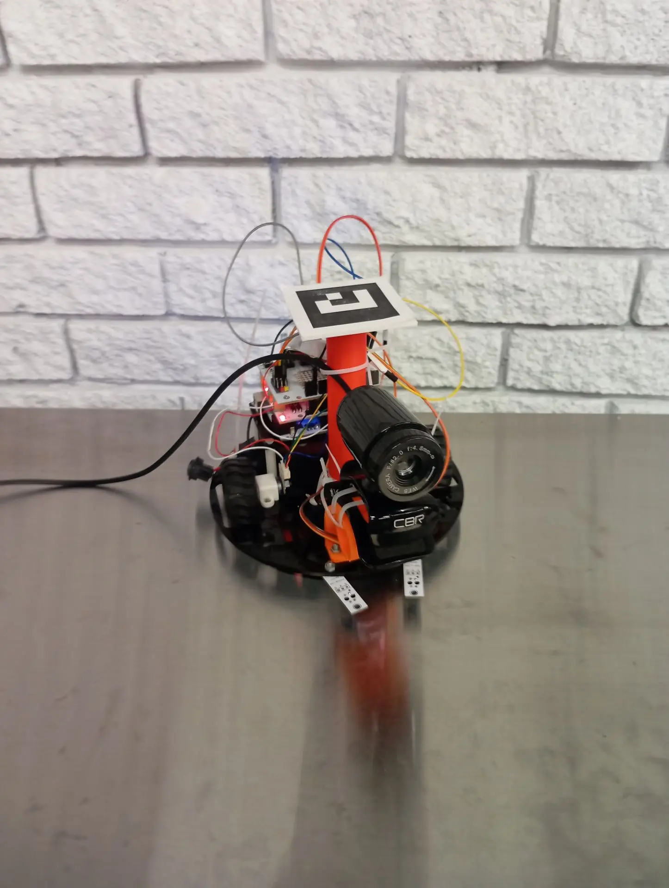
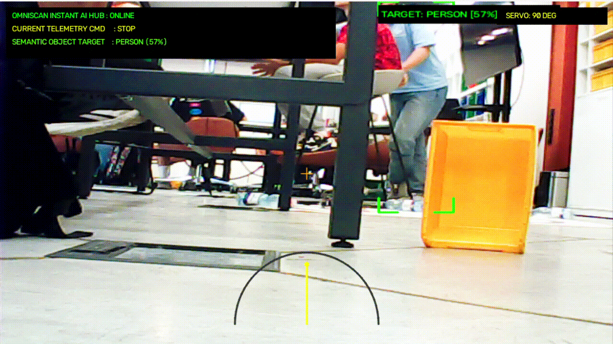

# OmniScan: Active Vision 🛰️ 
 мобильный ИИ-комплекс телеуправления

> **OmniScan: Active Vision** — программно-аппаратный комплекс мобильной робототехники, реализующий концепцию **Active Vision** — эгоцентрического динамического ИИ-зрения от первого лица (**FPV**). Комплекс сочетает компьютерное зрение, нейросетевую детекцию объектов, удалённое управление мобильной платформой и аппаратную систему стабилизации движения на базе ПИД-регулирования.

Главная особенность проекта заключается в использовании **USB-камеры**, установленной на **поворотной оси сервопривода**, благодаря чему обзор окружающего пространства выполняется независимо от направления движения робота. Такой подход имитирует принцип активного зрения живых организмов, когда наблюдательная система самостоятельно изменяет направление взгляда для исследования окружающей среды.

---

## 📸 
 Визуализация проекта

### 🤖 Внешний вид комплекса




### 📡 Демонстрация ИИ-комплекса в реальном времени




---

# 📖 
 Описание проекта

**OmniScan** представляет собой распределённую программно-аппаратную систему, состоящую из трёх независимых вычислительных уровней.

| Уровень | Назначение |
|----------|------------|
| 💻 ПК (Python 3.14) | Компьютерное зрение, интерфейс оператора, управление, обработка видео |
| 📡 
 ESP32-C3 | Высокоскоростной TCP ↔ UART мост |
| ⚙️ 
 Arduino Uno | Управление приводами, ПИД-регулятор, энкодеры, сервопривод |

Передача управляющих команд осуществляется по сети Wi-Fi посредством постоянного TCP-соединения, а нижний уровень управления обеспечивает точное движение платформы в режиме реального времени.

---

# 🚀 
 Ключевой функционал комплекса (Features)

## 🧠 
 Асинхронное ИИ-ядро YOLOv8s

Высокопроизводительная оффлайн-детекция объектов реализована на базе модели **YOLOv8s**.

Особенности реализации:

- многопоточная обработка кадров;
- отсутствие блокировки видеопотока;
- независимая работа ИИ и интерфейса;
- стабильный FPS во время вычислений;
- высокая точность обнаружения объектов.

---

## 🎯 
 Дизайнерский хай-тек прицел HUD

Для повышения информативности интерфейса реализована собственная система отображения целей.

Функциональность:

- неоновые углы вокруг обнаруженного объекта;
- интеллектуальная рамка сопровождения;
- оптическое перекрестие центра изображения;
- индикация состояния комплекса;
- отображение служебной информации поверх видеопотока.

---

## ⚙️ 
 Сквозной ПИД-контроль моторов

Система движения реализована полностью на нижнем уровне управления.

Возможности:

- ПИД-регулятор скорости;
- автоматическое удержание прямолинейного движения;
- интерполяционные таблицы коэффициентов ШИМ;
- обработка квадратурных энкодеров;
- вычисление скорости по разности тиков;
- период управления **50 Гц**.

Это позволяет значительно уменьшить уход платформы в сторону и обеспечить плавное движение.

---

## 🎮 Тактическое управление сервоприводом

Поворотная камера может мгновенно принимать заранее определённые положения.

| Клавиша | Положение камеры |
|----------|-----------------:|
| **I** | **0°** |
| **O** | **90°** |
| **P** | **180°** |

Разделение движения платформы и направления обзора позволяет реализовать концепцию **Active Vision**.

---

## ⚡ Мгновенный импульсный отклик (< 5 мс)

Для минимизации задержек используется постоянное TCP-соединение.

Особенности реализации:

- постоянный TCP-сокет;
- порт **8888**;
- отключение алгоритма Нейгла;
- использование **TCP_NODELAY**;
- отсутствие повторного открытия соединения.

В результате управляющие команды передаются практически мгновенно без накопления пакетов операционной системой.

---

## 📸 
 Модуль фотофиксации целей

При нажатии клавиши **C** автоматически выполняется:

- сохранение текущего кадра;
- сохранение полной ИИ-разметки;
- запись изображения в папку Рабочего стола;
- отображение уведомления непосредственно на HUD.

---

## 🛡️ 
 Velocity Watchdog

Для защиты мобильной платформы реализован аппаратный сторожевой таймер.

При отсутствии управляющих пакетов более **500 мс** Arduino автоматически:
- отключает питание двигателей;
- сбрасывает текущую скорость;
- предотвращает неконтролируемое движение робота при потере Wi-Fi соединения.

---

# 🔧 
 Аппаратная спецификация комплекса

```markdown
### 🔧 Аппаратная спецификация комплекса (Hardware Components)

Для сборки мобильного комплекса Active Vision были использованы следующие компоненты:

| Иконка | Название компонента | Кол-во | Техническая роль в системе |
| :---: | :--- | :---: | :--- |
| 🧠 | **Arduino Uno R3** | 1 шт. | Нижний уровень: ПИД-регулирование моторов, обработка одометрии и энкодеров [pid_rover_fixed.ino]. |
| 🛡️ | **Troyka Shield (Amperka)** | 1 шт. | Плата расширения для удобной и надежной коммутации датчиков и силовой части. |
| 📡 | **ESP32-C3 SuperMini** | 1 шт. | Средний уровень: Высокоскоростной прозрачный TCP/UART мост (порт 8888) [esp32_cam_stream_bridge.ino]. |
| 🎥 | **Внешняя USB-камера** | 1 шт. | Верхний уровень: Захват видеопотока для ИИ-анализа нейросетью YOLOv8s [ai_omni_test.py]. |
| ⚙️ | **Сервопривод FS90 / SG90** | 1 шт. | Активное зрение: Поворот оси камеры по тактическим командам `I, O, P` [pid_rover_fixed.ino, ai_omni_test.py]. |
| 🏎️ | **Мотор-редукторы с энкодерами** | 2 шт. | Ходовая часть: Тяговые двигатели (358 тиков/оборот) с обратной связью [pid_rover_fixed.ino]. |
| ⚡ | **DC-DC Step-Down (LM2596)** | 1 шт. | Защита логики: Выделенный стабилизатор 5.0V для ESP32 и Arduino против Brownout [esp32_cam_stream_bridge.ino]. |
| 🔋 | **Аккумуляторы Li-Ion 18650** | 2 шт. | Источник питания: Силовая сборка 7.4V–8.4V для снабжения ходовых двигателей. |
| 🧭 | **Датчик расстояния Sharp GP2Y0A21**| 1 шт. | Сенсорика: ИК-дальномер для вывода данных на тактический радар HUD [pid_rover_fixed.ino, ai_omni_test.py]. |

```


# 📚 Исходные коды проекта

Для удобства навигации основные программные модули проекта представлены в виде интерактивных HTML-спойлеров. Это позволяет сохранить компактность страницы репозитория GitHub.

---

<details>

<summary><strong>💻 ИИ-клиент управления на Python (OmniSkan/Codes&Filmware/OmniSkan.py)</strong></summary>

```python
import cv2
import numpy as np
import math
import time
import socket
import threading
import os
from datetime import datetime
from ultralytics import YOLO, settings

# === ГЛОБАЛЬНЫЕ ТАКТИЧЕСКИЕ ПЕРЕМЕННЫЕ ===
current_servo_angle = 90  # Стартовый угол сервопривода
current_cmd = "STOP"      # Текущая команда движения для Arduino
ai_detected_object = "NOTHING SPECIAL"
screenshot_alert_until = 0.0  # Таймер вывода плашки о сохранении кадра

# Автоматическое создание папки для скриншотов на Рабочем столе
DESKTOP_PATH = r"C:\Users\ibrag\Desktop"
SAVE_DIR = os.path.join(DESKTOP_PATH, "OmniScan_Screenshots")
if not os.path.exists(SAVE_DIR):
    os.makedirs(SAVE_DIR)

# Скоростные константы под вашу ПИД-прошивку Arduino Uno
TARGET_LINEAR_SPEED = 350   # Чуть меньше максимума (максимум 400 мм/с)
TARGET_ANGULAR_SPEED = 4500 # Скорость разворота на месте в мрад/с

ROBOT_IP = "192.168.4.1"
TCP_PORT = 8888

# Отключаем онлайн-синхронизацию весов для мгновенного старта YOLOv8 в оффлайне
settings.update({'sync': False, 'uuid': 'offline'}) 
print("[SYSTEM]: Загрузка продвинутой обученной ИИ-модели YOLOv8n.pt...")
model = YOLO('yolov8n.pt', task='detect')

# Переменные для обмена данными между видео и ИИ-потоком
latest_frame = None
processed_frame = None
frame_lock = threading.Lock()
global_tcp_socket = None

# --- 1. ВЫСОКОСКОРОСТНОЙ ПОСТОЯННЫЙ СОКЕТ-ПОТОК (ОТКЛИК < 5 МС) ---
def tcp_sender_loop():
    global current_cmd, current_servo_angle, global_tcp_socket
    print("[+] Высокоскоростной постоянный TCP-канал запущен.")
    
    while True:
        try:
            if global_tcp_socket is None:
                global_tcp_socket = socket.socket(socket.AF_INET, socket.SOCK_STREAM)
                global_tcp_socket.settimeout(0.5)
                global_tcp_socket.connect((ROBOT_IP, TCP_PORT))
                global_tcp_socket.setsockopt(socket.IPPROTO_TCP, socket.TCP_NODELAY, 1)
                print("[+] Железобетонное Wi-Fi соединение с ESP32-C3 установлено!")
            
            cmd_string = f"SERVO {int(current_servo_angle)}\n{current_cmd}\n"
            global_tcp_socket.sendall(cmd_string.encode('utf-8'))
        except Exception:
            if global_tcp_socket:
                try: global_tcp_socket.close()
                except: pass
                global_tcp_socket = None
            time.sleep(0.3)
        time.sleep(0.04)

# --- 2. АСИНХРОННЫЙ ПОТОК НЕЙРОСЕТИ С ЖЕСТКИМ ИСПРАВЛЕНИЕМ ИНДЕКСА [0] ---
def ai_processing_loop():
    global latest_frame, processed_frame, ai_detected_object
    print("[+] Асинхронное ИИ-ядро успешно заведено в фоне.")
    
    while True:
        frame_to_process = None
        with frame_lock:
            if latest_frame is not None:
                frame_to_process = latest_frame.copy()
        
        if frame_to_process is not None:
            yolo_results = model(frame_to_process, imgsz=256, verbose=False) 
            found_target = "NOTHING SPECIAL"

            # ЖЕСТКОЕ ИСПРАВЛЕНИЕ: Добавлен индекс [0] для работы со списком детекции Ultralytics
            if len(yolo_results) > 0 and len(yolo_results[0].boxes) > 0:
                top_box = yolo_results[0].boxes[0] # Берем первый найденный объект на первом кадре
                conf = float(top_box.conf[0])
                cls_id = int(top_box.cls[0])
                label = model.names[cls_id]

                if conf > 0.45 and label != 'floor':
                    found_target = f"{label.upper()} ({int(conf*100)}%)"
                    
                    box_coords = top_box.xyxy.cpu().numpy()[0].astype(int)
                    x1, y1, x2, y2 = box_coords[0], box_coords[1], box_coords[2], box_coords[3]
                    
                    # --- КРАСИВАЯ ДИЗАЙНЕРСКАЯ ОТРИСОВКА ЗАХВАТА ЦЕЛИ ---
                    color = (0, 255, 0) # Ярко-зеленый неоновый цвет
                    thickness = 2
                    length = 20 # Длина угловых засечек прицела
                    
                    cv2.line(frame_to_process, (x1, y1), (x1 + length, y1), color, thickness)
                    cv2.line(frame_to_process, (x1, y1), (x1, y1 + length), color, thickness)
                    cv2.line(frame_to_process, (x2, y1), (x2 - length, y1), color, thickness)
                    cv2.line(frame_to_process, (x2, y1), (x2, y1 + length), color, thickness)
                    cv2.line(frame_to_process, (x1, y2), (x1 + length, y2), color, thickness)
                    cv2.line(frame_to_process, (x1, y2), (x1, y2 - length), color, thickness)
                    cv2.line(frame_to_process, (x2, y2), (x2 - length, y2), color, thickness)
                    cv2.line(frame_to_process, (x2, y2), (x2, y2 - length), color, thickness)
                    
                    label_str = f" TARGET: {label.upper()} [{int(conf*100)}%]"
                    cv2.rectangle(frame_to_process, (x1, max(y1 - 25, 5)), (x1 + len(label_str)*9, max(y1, 30)), (0, 0, 0), -1)
                    cv2.putText(frame_to_process, label_str, (x1, max(y1 - 7, 22)), 
                                cv2.FONT_HERSHEY_SIMPLEX, 0.4, color, 1, cv2.LINE_AA)

            ai_detected_object = found_target
            with frame_lock:
                processed_frame = frame_to_process
        
        time.sleep(0.05)

# --- 3. ОСНОВНОЙ ВЫЧИСЛИТЕЛЬНЫЙ ЦИКЛ ОБРАБОТКИ ВИДЕО И КЛАВИАТУРЫ ---
def main():
    global current_cmd, current_servo_angle, ai_detected_object, latest_frame, processed_frame, screenshot_alert_until
    
    threading.Thread(target=tcp_sender_loop, daemon=True).start()
    threading.Thread(target=ai_processing_loop, daemon=True).start()

    camera_index = 1
    cap = cv2.VideoCapture(camera_index, cv2.CAP_DSHOW)
    
    cap.set(cv2.CAP_PROP_FOURCC, cv2.VideoWriter_fourcc(*'MJPG'))
    cap.set(cv2.CAP_PROP_FRAME_WIDTH, 640)
    cap.set(cv2.CAP_PROP_FRAME_HEIGHT, 480)
    cap.set(cv2.CAP_PROP_BUFFERSIZE, 1) 
    
    if not cap.isOpened():
        print(f"[-] КРИТИЧЕСКАЯ ОШИБКА: Нет доступа к камере под индексом {camera_index}")
        return

    print("[+] Высокоскоростной USB-видеопоток успешно запущен!")
    cv2.namedWindow("OMNISCAN: INSTANT HUD CENTER")

    print("\n" + "="*50)
    print("[УПРАВЛЕНИЕ MOTORS]: W, S, A, D - Движение (Удержание)")
    print("[УГЛЫ ГОЛОВЫ СЕРВО]: I - Прямо(90) | O - Вбок(20) | P - Прямо(90)")
    print("[ФОТОФИКСАЦИЯ ИИ  ]: Клавиша 'C' - Сделать СКРИНШОТ с ИИ-разметкой на ноутбук")
    print("[ВЫХОД ИЗ КЛИЕНТА ]: Клавиша 'ESC' - Закрыть софт")
    print("="*50 + "\n")

    try:
        while True:
            ret, frame = cap.read()
            if not ret or frame is None:
                continue

            with frame_lock:
                latest_frame = frame
                display_frame = processed_frame.copy() if processed_frame is not None else frame.copy()

            display_frame = cv2.resize(display_frame, (1024, 576))

            # --- ГРАФИЧЕСКИЙ ИНТЕРФЕЙС HUD РАДАРА ВНИЗУ ЭКРАНА ---
            radar_center_x, radar_center_y = 512, 540
            cv2.ellipse(display_frame, (radar_center_x, radar_center_y), (120, 120), 0, 180, 360, (60, 60, 60), 2, cv2.LINE_AA)
            
            angle_rad = math.radians(current_servo_angle)
            beam_len = 100
            bx = int(radar_center_x - beam_len * math.cos(angle_rad))
            by = int(radar_center_y - beam_len * math.sin(angle_rad))
            
            cv2.line(display_frame, (radar_center_x, radar_center_y), (bx, by), (0, 255, 255), 2, cv2.LINE_AA)
            cv2.circle(display_frame, (bx, by), 4, (0, 255, 255), -1)

            # Вывод тактической HUD-панели управления поверх кадра
            cv2.rectangle(display_frame, (10, 10), (560, 95), (0, 0, 0), -1)
            cv2.putText(display_frame, "OMNISCAN INSTANT AI HUB : ONLINE", (20, 28), cv2.FONT_HERSHEY_SIMPLEX, 0.45, (0, 255, 0), 1, cv2.LINE_AA)
            cv2.putText(display_frame, f"CURRENT TELEMETRY CMD     : {current_cmd}", (20, 50), cv2.FONT_HERSHEY_SIMPLEX, 0.45, (0, 255, 255), 1, cv2.LINE_AA)
            cv2.putText(display_frame, f"SEMANTIC OBJECT TARGET    : {ai_detected_object}", (20, 72), cv2.FONT_HERSHEY_SIMPLEX, 0.45, (0, 255, 100) if ai_detected_object != "NOTHING SPECIAL" else (140, 140, 140), 1, cv2.LINE_AA)
            
            cv2.rectangle(display_frame, (830, 10), (1014, 38), (0, 0, 0), -1)
            cv2.putText(display_frame, f"SERVO: {int(current_servo_angle)} DEG", (845, 28), cv2.FONT_HERSHEY_SIMPLEX, 0.45, (0, 255, 255), 1, cv2.LINE_AA)

            # ВСПЛЫВАЮЩИЙ ИНДИКАТОР УСПЕШНОГО СОХРАНЕНИЯ СНИМКА
            if time.time() < screenshot_alert_until:
                cv2.rectangle(display_frame, (390, 20), (634, 55), (0, 0, 0), -1)
                cv2.rectangle(display_frame, (390, 20), (634, 55), (0, 255, 0), 1)
                cv2.putText(display_frame, "[ SCREENSHOT SAVED ]", (420, 42), 
                            cv2.FONT_HERSHEY_SIMPLEX, 0.45, (0, 255, 0), 1, cv2.LINE_AA)

            # Отрисовка прицельной сетки
            cv2.drawMarker(display_frame, (512, 288), (0, 165, 255), cv2.MARKER_CROSS, 20, 1, cv2.LINE_AA)

            cv2.imshow("OMNISCAN: INSTANT HUD CENTER", display_frame)
            
            # --- МГНОВЕННАЯ ИМПУЛЬСНАЯ ОТПРАВКА КОМАНД С КЛАВИАТУРЫ ---
            is_any_key_pressed = False
            key = cv2.waitKey(1) & 0xFF
            
            if key == 27: 
                break
            
            # ФУНКЦИЯ ФОТОФИКСАЦИИ ЦЕЛИ (КЛАВИША С)
            elif key == ord('c'):
                timestamp = datetime.now().strftime("%Y%m%d_%H%M%S")
                filename = f"capture_{timestamp}.jpg"
                full_path = os.path.join(SAVE_DIR, filename)
                cv2.imwrite(full_path, display_frame)
                print(f"[+] Снимок успешно сохранен: {full_path}")
                screenshot_alert_until = time.time() + 0.6  
                
            elif key == ord('w'): 
                is_any_key_pressed = True
                current_cmd = f"VEL {TARGET_LINEAR_SPEED} 0" 
            elif key == ord('s'): 
                is_any_key_pressed = True
                current_cmd = f"VEL -{TARGET_LINEAR_SPEED} 0"
            
            # ИСПРАВЛЕНО: Точное соответствие знаков угловой скорости прошивке Arduino Uno
            elif key == ord('a'): 
                is_any_key_pressed = True
                current_cmd = f"VEL 0 {TARGET_ANGULAR_SPEED}"   # Поворот налево (A)
            elif key == ord('d'): 
                is_any_key_pressed = True
                current_cmd = f"VEL 0 -{TARGET_ANGULAR_SPEED}"  # Поворот направо (D)
            
            # Тактическое мгновенное переключение углов головы по вашим 3 кнопкам
            elif key == ord('i'): current_servo_angle = 0
            elif key == ord('o'): current_servo_angle = 120 
            elif key == ord('p'): current_servo_angle = 180  
            
            if not is_any_key_pressed:
                current_cmd = "STOP"
                
    finally:
        if global_tcp_socket: global_tcp_socket.close()
        cap.release()
        cv2.destroyAllWindows()

if __name__ == "__main__":
    main()
```

</details>

---

<details>

<summary><strong>📡 
 Прошивка TCP/UART моста для ESP32 (OmniSkan/Codes&Filmware/Esp32.ino)</strong></summary>

```cpp
// Финальная прошивка ESP32-C3 дня 2.
// Роль платы намеренно ограничена транспортом:
// точка доступа + DHCP + статусная веб-страница + TCP/UART мост.
// Моторы, датчики, одометрия и watchdog всегда остаются в Arduino.

#include <WebServer.h>
#include <WiFi.h>

const char *AP_NAME = "Vnfoo567";
const char *AP_PASSWORD = "Vnfoo567";
const uint16_t TCP_PORT = 8888;
const uint8_t ROBOT_RX_PIN = 4;
const uint8_t ROBOT_TX_PIN = 5;

HardwareSerial robotSerial(1);
WebServer server(80);
WiFiServer tcpServer(TCP_PORT);
WiFiClient tcpClient;
char tcpLine[192];
uint8_t tcpLength = 0;
char uartLine[192];
uint8_t uartLength = 0;
unsigned long commandsFromPc = 0;
unsigned long linesFromArduino = 0;

void sendTcp(const char *text) {
  if (tcpClient && tcpClient.connected()) {
    tcpClient.println(text);
  }
}

void showStatus() {
  String page =
      "<!doctype html><meta charset='utf-8'>"
      "<meta name='viewport' content='width=device-width'>"
      "<style>body{font-family:sans-serif;max-width:600px;margin:30px auto}"
      "b{color:#1677d2}</style><h1>NEYMARK Robot</h1>"
      "<p>Wi-Fi: <b>";
  page += AP_NAME;
  page += "</b></p><p>TCP: <b>192.168.4.1:";
  page += String(TCP_PORT);
  page += "</b></p><p>Клиент: <b>";
  page += (
      tcpClient && tcpClient.connected() ? "подключён" : "нет");
  page += "</b></p><p>Команд от ПК: ";
  page += String(commandsFromPc);
  page += "</p><p>Строк от Arduino: ";
  page += String(linesFromArduino);
  page += "</p>";
  server.send(200, "text/html; charset=utf-8", page);
}

void acceptTcpClient() {
  if (tcpClient && tcpClient.connected()) return;
  tcpClient = tcpServer.available();
  if (tcpClient) {
    tcpClient.setNoDelay(true);
    tcpLength = 0;
  }
}

void readTcpClient() {
  while (tcpClient && tcpClient.available()) {
    const char symbol = tcpClient.read();
    if (symbol == '\n' || symbol == '\r') {
      if (tcpLength > 0) {
        tcpLine[tcpLength] = '\0';
        robotSerial.println(tcpLine);
        commandsFromPc++;
        tcpLength = 0;
      }
    } else if (tcpLength < sizeof(tcpLine) - 1) {
      tcpLine[tcpLength++] = symbol;
    } else {
      tcpLength = 0;
      sendTcp("ERR LINE_TOO_LONG");
    }
  }
}

void readRobotSerial() {
  while (robotSerial.available()) {
    const char symbol = robotSerial.read();
    if (symbol == '\n' || symbol == '\r') {
      if (uartLength > 0) {
        uartLine[uartLength] = '\0';
        sendTcp(uartLine);
        linesFromArduino++;
        uartLength = 0;
      }
    } else if (uartLength < sizeof(uartLine) - 1) {
      uartLine[uartLength++] = symbol;
    } else {
      uartLength = 0;
    }
  }
}

void setup() {
  Serial.begin(115200);
  robotSerial.begin(
      38400, SERIAL_8N1, ROBOT_RX_PIN, ROBOT_TX_PIN);

  WiFi.disconnect(true);
  WiFi.mode(WIFI_OFF);
  delay(300);
  WiFi.mode(WIFI_AP);
  delay(100);
  WiFi.setSleep(false);
  WiFi.setTxPower(WIFI_POWER_8_5dBm);
  WiFi.softAP(AP_NAME, AP_PASSWORD);

  tcpServer.begin();
  server.on("/", HTTP_GET, showStatus);
  server.begin();

  Serial.println("READY ESP32_DAY2");
  Serial.println("Wi-Fi: Vnfoo567 / Vnfoo567");
  Serial.println("TCP: 192.168.4.1:8888");
}

void loop() {
  server.handleClient();
  acceptTcpClient();
  readTcpClient();
  readRobotSerial();
}
```

</details>

---

<details>

<summary><strong>⚙️ 
 ПИД-прошивка нижнего уровня (OmniSkan/Codes&Filmware/Arduino.ino)</strong></summary>

```cpp
// Финальная исправленная прошивка Arduino дня 2.
// Интегрирован раздельный ПИД-регулятор скорости колес + ПИД-выравниватель прямой.
// Знаки скоростей и направления моторов полностью согласованы с Python-автопилотом.

#include <Servo.h>
#include <SoftwareSerial.h>
#include <math.h>
#include <stdlib.h>
#include <string.h>

const uint8_t LEFT_DIR_PIN = 4;
const uint8_t LEFT_PWM_PIN = 5;
const uint8_t RIGHT_PWM_PIN = 6;
const uint8_t RIGHT_DIR_PIN = 7;
const uint8_t LEFT_ENCODER_A_PIN = 2;
const uint8_t LEFT_ENCODER_B_PIN = 8;
const uint8_t RIGHT_ENCODER_A_PIN = 3;
const uint8_t RIGHT_ENCODER_B_PIN = 10;
const uint8_t SERVO_PIN = 9;
const uint8_t LEFT_LINE_PIN = A0;
const uint8_t RIGHT_LINE_PIN = A1;
const uint8_t IR_DISTANCE_PIN = A2;

const uint8_t ESP_RX_PIN = A4;
const uint8_t ESP_TX_PIN = A5;

// Геометрия робота (в миллиметрах)
const float WHEEL_DIAMETER_MM = 44.0f;
const float WHEEL_BASE_MM = 128.0f;
const float ENCODER_TICKS_PER_REV = 358.0f;
const float MM_PER_TICK = PI * WHEEL_DIAMETER_MM / ENCODER_TICKS_PER_REV;
const float IR_K = 3782.0f;
const float IR_C = 96.0f;

const unsigned long CONTROL_PERIOD_MS = 50;
const unsigned long TELEMETRY_PERIOD_MS = 200;
const unsigned long VELOCITY_WATCHDOG_MS = 500;
const unsigned long START_BOOST_MS = 200;
const unsigned long SERVO_MOVE_MS = 180;

// Скоростные ограничения
const int MIN_LINEAR_MM_S = 100;
const int MAX_LINEAR_MM_S = 400;
const int MIN_ANGULAR_MRAD_S = 1000;
const int MAX_ANGULAR_MRAD_S = 6000;
const float MAX_WHEEL_SPEED_MM_S = 400.0f;

const int LEFT_START_FORWARD_PWM = 130;  // Было 100
const int LEFT_START_REVERSE_PWM = 130;  // Было 100
const int RIGHT_START_FORWARD_PWM = 120; // Было 90
const int RIGHT_START_REVERSE_PWM = 140; // Было 110

const int MIN_HOLD_PWM = 40;

// === КОЭФФИЦИЕНТЫ ПИД-РЕГУЛЯТОРА СКОРОСТИ ===
const float PID_KP = 0.25f;  // Пропорциональный коэффициент
const float PID_KI = 0.15f;  // Интегральный коэффициент (исправляет дрейф моторов)
const float PID_KD = 0.05f;  // Дифференциальный коэффициент (демпфирует рывки)
const float MAX_PID_CORRECTION = 70.0f;

// Коэффициент выравнивания прямой
const float STRAIGHT_PID_KP = 1.8f;
const float MAX_STRAIGHT_CORRECTION_MM_S = 45.0f;

// Таблицы аппроксимации PWM
const uint8_t MOTOR_TABLE_SIZE = 16;
const int SPEED_TABLE[MOTOR_TABLE_SIZE] = {
  0, 75, 100, 125, 150, 175, 200, 225,
  250, 275, 300, 325, 350, 375, 395, 400
};
const int LEFT_FORWARD_PWM_TABLE[MOTOR_TABLE_SIZE] = {
  0, 40, 45, 49, 54, 59, 66, 73, 80, 91, 102, 119, 142, 175, 215, 220
};
const int LEFT_REVERSE_PWM_TABLE[MOTOR_TABLE_SIZE] = {
  0, 41, 46, 50, 55, 60, 66, 72, 80, 90, 102, 117, 138, 171, 210, 220
};
const int RIGHT_FORWARD_PWM_TABLE[MOTOR_TABLE_SIZE] = {
  0, 44, 48, 53, 58, 63, 69, 77, 85, 95, 108, 124, 147, 178, 220, 220
};
const int RIGHT_REVERSE_PWM_TABLE[MOTOR_TABLE_SIZE] = {
  0, 43, 48, 52, 58, 63, 69, 76, 85, 95, 108, 125, 147, 181, 219, 220
};

const uint8_t COMMAND_BUFFER_SIZE = 96;

// Структура ПИД-состояния для каждого колеса отдельно
struct PidState {
  int8_t previousDirection;
  unsigned long boostUntilMs;
  float integralError;
  float previousError;
};

SoftwareSerial espSerial(ESP_RX_PIN, ESP_TX_PIN);
Servo scannerServo;

volatile long leftTicks = 0;
volatile long rightTicks = 0;
long previousLeftTicks = 0;
long previousRightTicks = 0;
long straightStartLeft = 0;
long straightStartRight = 0;

float xMm = 0.0f;
float yMm = 0.0f;
float thetaRad = 0.0f;
float leftSpeedMmS = 0.0f;
float rightSpeedMmS = 0.0f;
float targetLeftMmS = 0.0f;
float targetRightMmS = 0.0f;

int requestedLinearMmS = 0;
int requestedAngularMradS = 0;
int servoAngleDeg = 90;
bool controlEnabled = false;
bool straightActive = false;
unsigned long servoDetachMs = 0;

PidState leftPid = {0, 0, 0.0f, 0.0f};
PidState rightPid = {0, 0, 0.0f, 0.0f};

char usbCommandBuffer[COMMAND_BUFFER_SIZE];
uint8_t usbCommandLength = 0;
char espCommandBuffer[COMMAND_BUFFER_SIZE];
uint8_t espCommandLength = 0;
unsigned long previousControlMs = 0;
unsigned long previousTelemetryMs = 0;
unsigned long lastVelocityCommandMs = 0;

void onLeftEncoder() { leftTicks += digitalRead(LEFT_ENCODER_B_PIN) ? 1 : -1; }
void onRightEncoder() { rightTicks += digitalRead(RIGHT_ENCODER_A_PIN) ? -1 : 1; } // Исправлены знаки осей

void copyTicks(long &left, long &right) {
  noInterrupts();
  left = leftTicks;
  right = rightTicks;
  interrupts();
}

int8_t signOf(float value) {
  if (value > 0.5f) return 1;
  if (value < -0.5f) return -1;
  return 0;
}

float normalizeAngle(float angle) {
  while (angle > PI) angle -= 2.0f * PI;
  while (angle < -PI) angle += 2.0f * PI;
  return angle;
}

int applySignedMinimum(int value, int minimum, int maximum) {
  if (value == 0) return 0;
  const int magnitude = constrain(abs(value), minimum, maximum);
  return value > 0 ? magnitude : -magnitude;
}

void setMotor(uint8_t dirPin, uint8_t pwmPin, int pwm) {
  digitalWrite(dirPin, pwm < 0 ? HIGH : LOW);
  analogWrite(pwmPin, abs(constrain(pwm, -255, 255)));
}

void setMotors(int leftPwm, int rightPwm) {
  setMotor(LEFT_DIR_PIN, LEFT_PWM_PIN, leftPwm);
  setMotor(RIGHT_DIR_PIN, RIGHT_PWM_PIN, rightPwm);
}

void resetPidState(PidState &state) {
  state.previousDirection = 0;
  state.boostUntilMs = 0;
  state.integralError = 0.0f;
  state.previousError = 0.0f;
}

void stopMotion() {
  requestedLinearMmS = 0;
  requestedAngularMradS = 0;
  targetLeftMmS = 0.0f;
  targetRightMmS = 0.0f;
  controlEnabled = false;
  straightActive = false;
  resetPidState(leftPid);
  resetPidState(rightPid);
  setMotors(0, 0);
}

void resetOdometry() {
  copyTicks(previousLeftTicks, previousRightTicks);
  straightStartLeft = previousLeftTicks;
  straightStartRight = previousRightTicks;
  xMm = 0.0f;
  yMm = 0.0f;
  thetaRad = 0.0f;
  leftSpeedMmS = 0.0f;
  rightSpeedMmS = 0.0f;
}

int readIrDistanceCm() {
  const int raw = analogRead(IR_DISTANCE_PIN);
  if (raw >= 700) return 5;
  if (raw < 160) return 60;
  const float distance = IR_K / (raw - IR_C);
  return constrain((int)(distance + 0.5f), 5, 60);
}

int servoPhysicalAngle(int logicalAngle) { return 180 - logicalAngle; }

void moveServo(int angle) {
  angle = constrain(angle, 20, 160);
  if (angle == servoAngleDeg) return;
  servoAngleDeg = angle;
  if (!scannerServo.attached()) scannerServo.attach(SERVO_PIN);
  scannerServo.write(servoPhysicalAngle(servoAngleDeg));
  servoDetachMs = millis() + SERVO_MOVE_MS;
}

void updateServo(unsigned long nowMs) {
  if (scannerServo.attached() && (long)(nowMs - servoDetachMs) >= 0) {
    scannerServo.detach();
  }
}

void setVelocity(int linearMmS, int angularMradS) {
  requestedLinearMmS = applySignedMinimum(linearMmS, MIN_LINEAR_MM_S, MAX_LINEAR_MM_S);
  requestedAngularMradS = applySignedMinimum(angularMradS, MIN_ANGULAR_MRAD_S, MAX_ANGULAR_MRAD_S);

  const bool newStraight = requestedLinearMmS != 0 && requestedAngularMradS == 0;
  if (newStraight && !straightActive) {
    copyTicks(straightStartLeft, straightStartRight);
  }
  straightActive = newStraight;
  controlEnabled = requestedLinearMmS != 0 || requestedAngularMradS != 0;
  if (!controlEnabled) stopMotion();
}

void updateOdometry(long deltaLeftTicks, long deltaRightTicks) {
  const float leftDistance = deltaLeftTicks * MM_PER_TICK;
  const float rightDistance = deltaRightTicks * MM_PER_TICK;
  const float distance = 0.5f * (leftDistance + rightDistance);
  const float deltaTheta = (rightDistance - leftDistance) / WHEEL_BASE_MM;
  const float middleTheta = thetaRad + 0.5f * deltaTheta;

  xMm += distance * cos(middleTheta);
  yMm += distance * sin(middleTheta);
  thetaRad = normalizeAngle(thetaRad + deltaTheta);
}

int tablePwm(uint8_t index, bool leftMotor, bool forward) {
  if (leftMotor && forward) return LEFT_FORWARD_PWM_TABLE[index];
  if (leftMotor && !forward) return LEFT_REVERSE_PWM_TABLE[index];
  if (!leftMotor && forward) return RIGHT_FORWARD_PWM_TABLE[index];
  return RIGHT_REVERSE_PWM_TABLE[index];
}

int calibratedPwm(float target, bool leftMotor) {
  const bool forward = target > 0.0f;
  const float speed = fabs(target);
  if (speed < 0.5f) return 0;
  if (speed <= SPEED_TABLE[1]) return MIN_HOLD_PWM;

  for (uint8_t index = 1; index < MOTOR_TABLE_SIZE - 1; index++) {
    if (speed <= SPEED_TABLE[index + 1]) {
      const float speed0 = SPEED_TABLE[index];
      const float speed1 = SPEED_TABLE[index + 1];
      const float pwm0 = tablePwm(index, leftMotor, forward);
      const float pwm1 = tablePwm(index + 1, leftMotor, forward);
      const float part = (speed - speed0) / (speed1 - speed0);
      return (int)(pwm0 + part * (pwm1 - pwm0));
    }
  }
  return tablePwm(MOTOR_TABLE_SIZE - 1, leftMotor, forward);
}

int startPwm(bool leftMotor, int8_t direction) {
  if (leftMotor && direction > 0) return LEFT_START_FORWARD_PWM;
  if (leftMotor && direction < 0) return LEFT_START_REVERSE_PWM;
  if (!leftMotor && direction > 0) return RIGHT_START_FORWARD_PWM;
  return RIGHT_START_REVERSE_PWM;
}

// === ПОЛНОЦЕННЫЙ ПИД-РЕГУЛЯТОР УПРАВЛЕНИЯ PWM КОЛЕСА ===
int calculateMotorPwm(float target, float measured, unsigned long nowMs, bool leftMotor, PidState &state) {
  const int8_t direction = signOf(target);
  if (direction == 0) {
    resetPidState(state);
    return 0;
  }

  if (direction != state.previousDirection) {
    state.previousDirection = direction;
    state.boostUntilMs = nowMs + START_BOOST_MS;
    state.integralError = 0.0f;
    state.previousError = 0.0f;
  }

  // Стартовый буст для преодоления трения редуктора
  if ((long)(state.boostUntilMs - nowMs) > 0) {
    int launchPwm = calibratedPwm(target, leftMotor);
    const int minimumStartPwm = startPwm(leftMotor, direction);
    if (launchPwm < minimumStartPwm) launchPwm = minimumStartPwm;
    return direction * launchPwm;
  }

  const float basePwm = calibratedPwm(target, leftMotor);
  const float error = target - measured;
  
  // Интегральная составляющая ПИД (накапливает и исправляет жесткую разницу)
  state.integralError = constrain(state.integralError + error * (CONTROL_PERIOD_MS * 0.001f), -40.0f, 40.0f);
  // Дифференциальная составляющая (гасит резкие прыжки)
  const float derivativeError = (error - state.previousError) / (CONTROL_PERIOD_MS * 0.001f);
  state.previousError = error;

  // Итоговое ПИД-вычисление
  const float correction = constrain(
    (PID_KP * error) + (PID_KI * state.integralError) + (PID_KD * derivativeError),
    -MAX_PID_CORRECTION, MAX_PID_CORRECTION
  );

  const float output = direction * basePwm + correction;
  if (direction > 0) return constrain((int)output, 0, 255);
  return constrain((int)output, -255, 0);
}

void updateControl(unsigned long nowMs) {
  if (nowMs - previousControlMs < CONTROL_PERIOD_MS) return;
  const float dt = (nowMs - previousControlMs) * 0.001f;
  previousControlMs = nowMs;

  long left, right;
  copyTicks(left, right);
  const long deltaLeft = left - previousLeftTicks;
  const long deltaRight = right - previousRightTicks;
  previousLeftTicks = left;
  previousRightTicks = right;

  leftSpeedMmS = deltaLeft * MM_PER_TICK / dt;
  rightSpeedMmS = deltaRight * MM_PER_TICK / dt;
  updateOdometry(deltaLeft, deltaRight);

  if (!controlEnabled) return;
  const float angularRadS = requestedAngularMradS * 0.001f;
  
  // Согласование знаков направления движения по протоколу Python
  targetLeftMmS = (angularRadS * WHEEL_BASE_MM * 0.5f) + requestedLinearMmS;
  targetRightMmS = (angularRadS * WHEEL_BASE_MM * 0.5f) - requestedLinearMmS;

  if (straightActive) {
    const int direction = requestedLinearMmS > 0 ? 1 : -1;
    const float leftProgress = (left - straightStartLeft) * MM_PER_TICK * direction;
    const float rightProgress = (right - straightStartRight) * MM_PER_TICK * direction;
    const float pathError = leftProgress - rightProgress;
    
    const float correction = constrain(STRAIGHT_PID_KP * pathError, -MAX_STRAIGHT_CORRECTION_MM_S, MAX_STRAIGHT_CORRECTION_MM_S);
    targetLeftMmS -= direction * correction;
    targetRightMmS += direction * correction;
  }

  targetLeftMmS = constrain(targetLeftMmS, -MAX_WHEEL_SPEED_MM_S, MAX_WHEEL_SPEED_MM_S);
  targetRightMmS = constrain(targetRightMmS, -MAX_WHEEL_SPEED_MM_S, MAX_WHEEL_SPEED_MM_S);

  const int leftPwm = calculateMotorPwm(targetLeftMmS, leftSpeedMmS, nowMs, true, leftPid);
  const int rightPwm = calculateMotorPwm(targetRightMmS, rightSpeedMmS, nowMs, false, rightPid);
  setMotors(leftPwm, rightPwm);
}

void sendLine(const char *line) {
  Serial.println(line);
  espSerial.println(line);
}

void sendTelemetry() {
  long left, right;
  copyTicks(left, right);
  const int linearMmS = (int)(0.5f * (leftSpeedMmS + rightSpeedMmS));
  const int angularMradS = (int)(1000.0f * (rightSpeedMmS - leftSpeedMmS) / WHEEL_BASE_MM);

  char line[150];
  snprintf(line, sizeof(line), "TEL %ld %ld %ld %d %d %ld %ld %d %d %d %d",
      (long)xMm, (long)yMm, (long)(thetaRad * 1000.0f), linearMmS, angularMradS,
      left, right, analogRead(LEFT_LINE_PIN), analogRead(RIGHT_LINE_PIN),
      readIrDistanceCm(), servoAngleDeg);
  sendLine(line);
}

void processCommand(char *line) {
  char *save = NULL;
  char *command = strtok_r(line, " ", &save);
  if (command == NULL) return;

  if (strcmp(command, "VEL") == 0) {
    char *linearText = strtok_r(NULL, " ", &save);
    char *angularText = strtok_r(NULL, " ", &save);
    if (linearText == NULL || angularText == NULL) {
      sendLine("ERR VEL_NEEDS_LINEAR_ANGULAR");
      return;
    }
    setVelocity(atoi(linearText), atoi(angularText));
    lastVelocityCommandMs = millis();
  } else if (strcmp(command, "SERVO") == 0) {
    char *angleText = strtok_r(NULL, " ", &save);
    if (angleText == NULL) {
      sendLine("ERR SERVO_NEEDS_ANGLE");
      return;
    }
    moveServo(atoi(angleText));
  } else if (strcmp(command, "RESET_ODOM") == 0) {
    stopMotion();
    resetOdometry();
    sendLine("OK RESET_ODOM");
  } else if (strcmp(command, "STOP") == 0) {
    stopMotion();
  } else if (strcmp(command, "PING") == 0) {
    sendLine("PONG ARDUINO");
  } else if (strcmp(command, "GET") == 0) {
    sendTelemetry();
  } else {
    sendLine("ERR UNKNOWN_COMMAND");
  }
}

void readCommands(Stream &stream, char *buffer, uint8_t &length) {
  while (stream.available()) {
    const char symbol = stream.read();
    if (symbol == '\n' || symbol == '\r') {
      if (length > 0) {
        buffer[length] = '\0';
        processCommand(buffer);
        length = 0;
      }
    } else if (length < COMMAND_BUFFER_SIZE - 1) {
      buffer[length++] = symbol;
    } else {
      length = 0;
      sendLine("ERR LINE_TOO_LONG");
    }
  }
}

void readUsbCommands() { readCommands(Serial, usbCommandBuffer, usbCommandLength); }
void readEspCommands() { readCommands(espSerial, espCommandBuffer, espCommandLength); }

void checkWatchdog(unsigned long nowMs) {
  if (controlEnabled && nowMs - lastVelocityCommandMs > VELOCITY_WATCHDOG_MS) {
    stopMotion();
    sendLine("EVENT WATCHDOG_STOP");
  }
}

void setup() {
  Serial.begin(115200);
  espSerial.begin(38400);
  pinMode(LEFT_DIR_PIN, OUTPUT);
  pinMode(LEFT_PWM_PIN, OUTPUT);
  pinMode(RIGHT_PWM_PIN, OUTPUT);
  pinMode(RIGHT_DIR_PIN, OUTPUT);
  pinMode(LEFT_ENCODER_A_PIN, INPUT);
  pinMode(LEFT_ENCODER_B_PIN, INPUT);
  pinMode(RIGHT_ENCODER_A_PIN, INPUT);
  pinMode(RIGHT_ENCODER_B_PIN, INPUT);
  pinMode(LEFT_LINE_PIN, INPUT);
  pinMode(RIGHT_LINE_PIN, INPUT);
  pinMode(IR_DISTANCE_PIN, INPUT);
  
  attachInterrupt(digitalPinToInterrupt(LEFT_ENCODER_A_PIN), onLeftEncoder, RISING);
  attachInterrupt(digitalPinToInterrupt(RIGHT_ENCODER_A_PIN), onRightEncoder, RISING);
  
  scannerServo.attach(SERVO_PIN);
  scannerServo.write(servoPhysicalAngle(servoAngleDeg));
  servoDetachMs = millis() + SERVO_MOVE_MS;
  
  stopMotion();
  resetOdometry();
  previousControlMs = millis();
  previousTelemetryMs = millis();
  sendLine("READY ARDUINO_DAY2_PID");
}

void loop() {
  readUsbCommands();
  readEspCommands();
  const unsigned long nowMs = millis();
  checkWatchdog(nowMs);
  updateControl(nowMs);
  updateServo(nowMs);

  if (nowMs - previousTelemetryMs >= TELEMETRY_PERIOD_MS) {
    previousTelemetryMs = nowMs;
    sendTelemetry();
  }
}
```

</details>

---

# 🔌 
 Схема физического подключения (Wiring Diagram)

| Устройство | Контакт | Подключение |
|------------|----------|-------------|
| 🔋 
 USB Camera | +5V | Внешний Step-Down DC-DC преобразователь |
| ⚫ USB Camera | GND | GND Troyka Shield |
| 📡 
 ESP32-C3 | RX (Pin 4) | TX Arduino Uno (A5) |
| 📡 
 ESP32-C3 | TX (Pin 5) | RX Arduino Uno (A4) |
| 🎮 Сервопривод | Signal | Arduino D9 (PWM) |

> **Важно:** питание USB-камеры рекомендуется осуществлять через отдельный понижающий DC-DC преобразователь. Это предотвращает просадки напряжения (**Brownout**) и самопроизвольные перезагрузки ESP32-C3 при пиковом энергопотреблении.

---

# 🛠️ 
 База знаний: секреты отладки (Debugging Notes)

При разработке распределённых робототехнических систем крайне важно быстро локализовывать неисправности отдельных модулей. В проекте **OmniScan: Active Vision** рекомендуется использовать два основных способа временного отключения кода без нарушения общей архитектуры программы.

---

## 🔹 
 Использование символа `#`

Символ решётки применяется для **точечного отключения отдельных строк кода**.

Такой способ удобен, когда необходимо временно исключить выполнение одной инструкции без изменения логики программы.

### Пример

```python
# print("Hello World") 
```

### Практические сценарии

- отключить отправку TCP-команд;
- проверить работу HUD без подключения робота;
- протестировать работу камеры отдельно;
- проверить работу клавиатуры;
- диагностировать сохранение снимков.

---

## 🔹 
 Использование тройных кавычек `''' ... '''`

Тройные кавычки позволяют временно отключать **целые блоки программы**, что особенно удобно при диагностике производительности.

### Пример

```python
'''
Hello = "Hello"
World = "World"
print(Hello+World) 
'''
```

### Практические сценарии

- полностью отключить поток YOLOv8;
- измерить максимальный FPS камеры;
- протестировать только сетевое взаимодействие;
- проверить работу интерфейса HUD без ИИ;
- изолировать отдельные алгоритмы во время поиска ошибок.

---

## 💡 
 Рекомендуемый порядок диагностики

| Этап | Что отключается | Цель проверки |
|------|-----------------|---------------|
| 1 | YOLOv8 | Измерение максимального FPS камеры |
| 2 | TCP-передача | Проверка локальной работы интерфейса |
| 3 | Отрисовка HUD | Анализ производительности видеопотока |
| 4 | ПИД-регулятор | Проверка работы энкодеров |
| 5 | Управление моторами | Безопасная диагностика без движения платформы |

---

# 🎮 Руководство оператора (How to Control)

## Шаг 1. Подключение к сети

Подключите ноутбук к беспроводной сети комплекса.

| Параметр | Значение |
|----------|-----------|
| 📶 
 SSID | **NEYMARK_01** |
| 🔑 
 Пароль | **neymark123** |

---

## Шаг 2. Установка зависимостей

```bash
pip install -r requirements.txt
```

---

## Шаг 3. Запуск программы

Из корневой директории репозитория выполните команду:

```bash
python software/OmniSkan.py
```

После запуска откроется окно видеопотока с интерфейсом оператора и активируется соединение с мобильной платформой.

---

# ⌨️ 
 Горячие клавиши управления

| Клавиша | Действие |
|----------|----------|
| **W** | Движение вперёд *(пока удерживается клавиша)* |
| **S** | Движение назад *(пока удерживается клавиша)* |
| **A** | Поворот влево *(пока удерживается клавиша)* |
| **D** | Поворот вправо *(пока удерживается клавиша)* |
| **I** | Повернуть сервопривод на **0°** |
| **O** | Повернуть сервопривод на **90°** |
| **P** | Повернуть сервопривод на **180°** |
| **C** | Сохранить снимок с ИИ-разметкой |
| **ESC** | Немедленное завершение программы |

> **Важно:** движение платформы выполняется **только пока удерживаются клавиши W, A, S, D**. После отпускания клавиши команда остановки отправляется автоматически.

---

# 🔄 
 Последовательность работы комплекса

```text
USB Camera
      │
      ▼
software/OmniSkan.py
      │
      ├──────────────► YOLOv8s
      │
      ├──────────────► HUD
      │
      ▼
TCP Socket (Port 8888)
      │
      ▼
ESP32-C3
      │
      ▼
UART
      │
      ▼
Arduino Uno
      │
      ├──────────────► PID Controller
      ├──────────────► Quadrature Encoders
      ├──────────────► Servo Control
      └──────────────► Motor Driver
      │
      ▼
Мобильная платформа
```

---

# 📊 
 Архитектура программно-аппаратного комплекса

| Подсистема | Назначение |
|------------|------------|
| 💻 **Codes&Filmware/OmniSkan.py** | Компьютерное зрение, интерфейс оператора, управление |
| 📡 
 **Codes&Filmware/Esp32.ino** | Прозрачный TCP ↔ UART мост |
| ⚙️ 
 **Codes&Filmware/Arduino.ino** | ПИД-регулятор, энкодеры, управление моторами и сервоприводом |
18:37
| 🧠 
 **YOLOv8s** | Детекция объектов в реальном времени |
| 🎯 
 **HUD** | Отображение информации оператору |
| 🛡️ 
 **Velocity Watchdog** | Аварийная остановка при потере связи |

---

# 🚀 
 Быстрый старт проекта (Quick Start)

Данный раздел описывает полный порядок подготовки, прошивки и запуска комплекса **OmniScan: Active Vision**.

---

# 🧰 
 Требования к программной части

## 💻 Компьютер оператора

Минимальная конфигурация:

| Компонент | Требование |
|-----------|------------|
| Операционная система | Windows 10 / Windows 11 |
| Python | **Python 3.14+** |
| Камера | USB Camera |
| Сетевой адаптер | Wi-Fi 2.4 ГГц |
| Интерфейс | USB для камеры |

---

# 📦 Установка программного окружения

## 1. Клонирование репозитория

```bash
git clone https://github.com/USERNAME/OmniScan-ActiveVision.git
```

Переход в папку проекта:

```bash
cd OmniScan-ActiveVision
```

---

## 2. Установка зависимостей Python

Создание виртуального окружения:

```bash
python -m venv venv
```

Активация окружения:

Windows:

```bash
venv\Scripts\activate
```

Linux:

```bash
source venv/bin/activate
```

Установка библиотек:

```bash
pip install -r requirements.txt
```

---

# 🔥 
 Прошивка аппаратной части

## 📡 
 ESP32-C3 TCP/UART Bridge

Файл прошивки:

```text
firmware/esp32/Esp32.ino
```

Назначение:

- подключение к Wi-Fi сети;
- создание TCP-сервера;
- прием команд управления;
- передача данных через UART.

Процесс загрузки:

1. Подключить ESP32-C3 через USB.
2. Открыть файл:

```text
firmware/esp32/Esp32.ino
```

3. Выбрать плату ESP32-C3.
4. Выполнить компиляцию.
5. Загрузить прошивку.

---

## ⚙️ 
 Arduino Uno PID Controller

Файл прошивки:

```text
firmware/arduino/Arduino.ino
```

Назначение:

- управление двигателями;
- обработка энкодеров;
- выполнение PID-алгоритма;
- управление сервоприводом;
- контроль безопасности.

Процесс загрузки:

1. Подключить Arduino Uno.
2. Открыть:

```text
firmware/arduino/Arduino.ino
```

3. Выбрать плату Arduino Uno.
4. Проверить COM-порт.
5. Выполнить загрузку.

---

# 📡 
 Сетевое подключение

После включения питания:

ESP32-C3 автоматически создаёт/подключается к сети:

| Параметр | Значение |
|----------|----------|
| 📶 
 Wi-Fi | NEYMARK_01 |
| 🔑 
 Пароль | neymark123 |
| 🔌 
 TCP порт | 8888 |

---

# ▶️ 
 Запуск комплекса

После включения:

1. Подать питание на мобильную платформу.
2. Дождаться подключения ESP32-C3.
3. Подключить ноутбук к Wi-Fi сети комплекса.
4. Запустить программу:

```bash
python software/OmniSkan.py
```

После запуска:

✅ активируется видеопоток;

✅ запускается YOLOv8s;

✅ появляется HUD-интерфейс;

✅ устанавливается TCP-соединение;

✅ становится доступно управление.

---

# 🧪 
 Режим диагностики перед демонстрацией

Перед запуском рекомендуется выполнить проверку:

| Проверка | Ожидаемый результат |
|----------|--------------------|
| 📷 Камера | Видео без задержек |
| 🧠 
 YOLOv8 | Объекты определяются |
| 🎯 
 HUD | Цели выделяются рамками |
| 📡 
 Wi-Fi | Стабильное соединение |
| ⚙️ 
 Энкодеры | Корректный подсчет тиков |
| 🚗 
 Моторы | Плавное движение |
| 🛡️ 
 Watchdog | Остановка при потере связи |

---

# 🏆 Демонстрационный сценарий

Рекомендуемый порядок показа комплекса:

```
1. Включение питания
          ↓
2. Подключение оператора
          ↓
3. Запуск OmniSkan.py
          ↓
4. Проверка видеопотока
          ↓
5. Демонстрация YOLOv8
          ↓
6. Наведение камеры сервоприводом
          ↓
7. Управление движением
          ↓
8. Фотофиксация цели
          ↓
9. Проверка аварийной остановки
```

---

# 🧩 
 Возможные проблемы и решения

| Проблема | Возможная причина | Решение |
|----------|------------------|---------|
| Камера не запускается | Нет доступа OpenCV | Проверить USB-подключение |
| ESP32 перезагружается | Просадка питания | Использовать внешний Step-Down |
| Есть задержка управления | Буферизация TCP | Проверить TCP_NODELAY |
| Робот уходит в сторону | Ошибка PID | Настроить коэффициенты |
| Нет управления | UART ошибка | Проверить RX/TX перекрестно |

---

# 📌 
 Итоговая архитектура

```text
                ОПЕРАТОР
                   │
                   ▼
        Python 3.14 + OmniSkan.py
                   │
        ┌──────────┴──────────┐

│                     │
        ▼                     ▼
     YOLOv8s                 HUD
        │
        ▼
    TCP :8888
        │
        ▼
     ESP32-C3
        │
       UART
        │
        ▼
    Arduino Uno
        │
 ┌──────┼────────┐
 ▼      ▼        ▼
PID   Servo   Motors

        ↓

    MOBILE ROVER
```

---

# ⭐ Заключение

**OmniScan: Active Vision** объединяет технологии:

- 🤖 
 мобильной робототехники;
- 🧠 
 искусственного интеллекта;
- 👁️ 
 компьютерного зрения;
- 📡 
 беспроводного управления;
- ⚙️ 
 систем автоматического регулирования.

Проект демонстрирует полноценную архитектуру автономного робототехнического комплекса с разделением вычислительных уровней и возможностью дальнейшего масштабирования.

---
